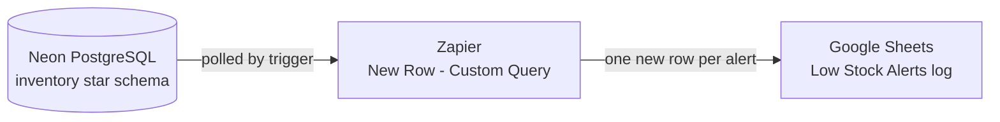

# Low-Stock Alert Automation

**PostgreSQL · SQL · Zapier · Google Sheets**

A small end-to-end automation that watches a daily inventory snapshot and logs every product-location pair that falls below its reorder threshold. I built it as a hands-on learning experiment on a synthetic inventory dataset, to understand how an automated stock alert works from the data model all the way to the notification.

---

## Architecture



1. **Neon (serverless PostgreSQL)** holds the inventory model and receives a daily stock snapshot.
2. **Zapier** polls the database with a custom SQL query and picks up rows it has not seen before.
3. **Google Sheets** receives one new row per alert, forming an alert log.

The alert logic lives entirely in SQL. Zapier only delivers the result.

---

## Data model

A small star schema modelled on dimensional-modelling patterns for inventory data.

| Table | Grain | Role |
|---|---|---|
| `dim_product` | one row per product **version** | Type-2 slowly changing dimension: *Wireless Mouse* moved from Accessories to Electronics on 2026-03-01 and has two surrogate keys |
| `dim_location` | one row per warehouse | Tallinn DC, Riga DC |
| `fact_stock_movements` | one row per stock movement | transaction-grain fact (receipts, shipments) |
| `fact_stock_snapshot` | one row per product version, location and day | periodic-snapshot fact storing the end-of-day balance |

The alert reads from the **snapshot** table. Recomputing the current balance by summing the full movement history on every poll would work, but it does not scale as history grows. A periodic snapshot answers "what is on hand now" directly.

Full schema and seed data: [`sql/01_schema_and_seed.sql`](sql/01_schema_and_seed.sql)

---

## The alert query

```sql
SELECT CONCAT(fs.snapshot_date, '-', fs.product_key, '-', fs.location_key) AS id,  -- stable dedupe key: one alert per breach
       fs.snapshot_date,
       dp.product_name,
       dl.location_name,
       fs.quantity_on_hand,
       TO_CHAR(CURRENT_TIMESTAMP AT TIME ZONE 'Europe/Tallinn',
               'YYYY-MM-DD HH24:MI:SS') AS queried_at   -- pickup time in local time; kept out of id on purpose
  FROM fact_stock_snapshot AS fs
  JOIN dim_product AS dp
    ON dp.product_key = fs.product_key      -- snapshot key = product version valid on that date (Type-2 SCD)
  JOIN dim_location AS dl
    ON dl.location_key = fs.location_key
 WHERE fs.snapshot_date = (SELECT MAX(snapshot_date) FROM fact_stock_snapshot)
   AND fs.quantity_on_hand < 100            -- reorder threshold (hard-coded for the demo)
 ORDER BY fs.quantity_on_hand;
```

File: [`sql/02_low_stock_alert.sql`](sql/02_low_stock_alert.sql). `TO_CHAR` and `AT TIME ZONE` are PostgreSQL syntax.

### Design decisions

**Composite `id` as the deduplication key.** Zapier's polling trigger decides whether a row is new by its `id`; the trigger test showed it used this column as the *Dedupe Key*. Building the key from snapshot date, product and location means each breach is logged exactly once. A product still below threshold in tomorrow's snapshot produces a new `id` and therefore a new alert.

**Volatile values stay out of the key.** `queried_at` changes on every poll. If it were part of `id`, every poll would look like a new row and the same alert would be sent again and again.

**Filtering in SQL, not in the automation tool.** The threshold check sits in the `WHERE` clause instead of a separate Zapier filter step. The rule is visible, versionable and testable in one place, and the workflow stays at two steps (trigger and action).

**Joining on the snapshot's surrogate key.** Each snapshot row points to the product version that was valid on that date, so the alert shows the correct attributes even for a reclassified product.

**Local time for the log.** The database runs in UTC. Converting to `Europe/Tallinn` and formatting as `YYYY-MM-DD HH24:MI:SS` gives a value Google Sheets recognises as a date, so the log can be sorted and filtered by time. The raw ISO/UTC value was stored as plain text.

**Latest snapshot via `MAX(snapshot_date)`.** Simple and cheap, and the snapshot table's primary key starts with `snapshot_date`. It assumes every daily load is complete.

---

## Zap configuration

| Step | App | Event |
|---|---|---|
| 1. Trigger | PostgreSQL | New Row (Custom Query), with the query above |
| 2. Action | Google Sheets | Create Spreadsheet Row |

| Sheet column | Mapped from |
|---|---|
| `alert_id` | ID |
| `snapshot_date` | Snapshot Date |
| `product_name` | Product Name |
| `location_name` | Location Name |
| `quantity_on_hand` | Quantity On Hand |
| `alerted_at` | Queried At |

---

## Testing and results

Before connecting Zapier, I ran the query directly in the Neon SQL editor and checked the expected output. When it first returned nothing, I checked row counts table by table and found that the snapshot insert had not run. The query itself was fine.

Test snapshots: [`sql/03_test_snapshots.sql`](sql/03_test_snapshots.sql)

| Snapshot | Breach in data | Logged in sheet |
|---|---|---|
| 2026-03-20 | Steel Bolt M8, Riga DC, 80 | ✅ via trigger test |
| 2026-03-21 | USB-C Cable 1m, Tallinn DC, 60 | ❌ not logged |
| 2026-03-22 | Wireless Mouse, Tallinn DC, 45 | ✅ picked up automatically by the live Zap |

What the test confirmed:

- The live Zap picked up a new snapshot on its own and logged the alert without manual action.
- No duplicate alerts: Steel Bolt M8 was not logged again, and it was restocked in later snapshots.
- The Wireless Mouse alert came through with its current product version (`product_key = 4`).

What the test revealed:

- **The 2026-03-21 breach was never logged.** The query only looks at the latest snapshot at the moment Zapier polls. If a newer snapshot has already loaded before the next poll, or the breach was already present when the Zap was switched on, that breach is never seen as a new row.

---

## Limitations and next steps

| Limitation | What I would change |
|---|---|
| Breaches can be missed between polls | Use a look-back window instead of only the latest snapshot. The `id` still prevents duplicates, so each breach arrives exactly once (see below) |
| Hard-coded threshold of 100 | Store a `reorder_point` per product and compare against it |
| Assumes complete daily snapshots | Add a load check or pick the latest snapshot per product-location with `ROW_NUMBER()`, partitioned by the business key `product_id`, not the surrogate key |
| Polling delay, depends on the Zapier plan | Acceptable for a daily snapshot; a near-real-time alert would need an event-driven setup |
| PostgreSQL is a premium app in Zapier | Fine for a demo on a trial; a production setup would need a paid plan or a scheduled job in the data stack |

Look-back window variant, tested on the demo data: it returns all three breaches.

```sql
 WHERE fs.snapshot_date >= (SELECT MAX(snapshot_date) FROM fact_stock_snapshot) - 7  -- last 7 days of snapshots
   AND fs.quantity_on_hand < 100
```

The window is relative to the latest snapshot rather than `CURRENT_DATE`, because the demo data is dated in the past. In production it would be `CURRENT_DATE - 7`.

---

## How to reproduce

1. Create a free PostgreSQL project on [Neon](https://neon.tech) and run `sql/01_schema_and_seed.sql` in the SQL editor.
2. Run `sql/02_low_stock_alert.sql`. Expected result: one row, Steel Bolt M8 at Riga DC with 80 units.
3. Create a Google Sheet with the headers `alert_id`, `snapshot_date`, `product_name`, `location_name`, `quantity_on_hand`, `alerted_at`.
4. In Zapier, set up the trigger and action as described above and publish the Zap. For Neon, the password field needs the format `endpoint=<endpoint_id>$<password>`.
5. Insert the snapshots from `sql/03_test_snapshots.sql` one at a time, waiting for a poll in between, and check the sheet.

---
